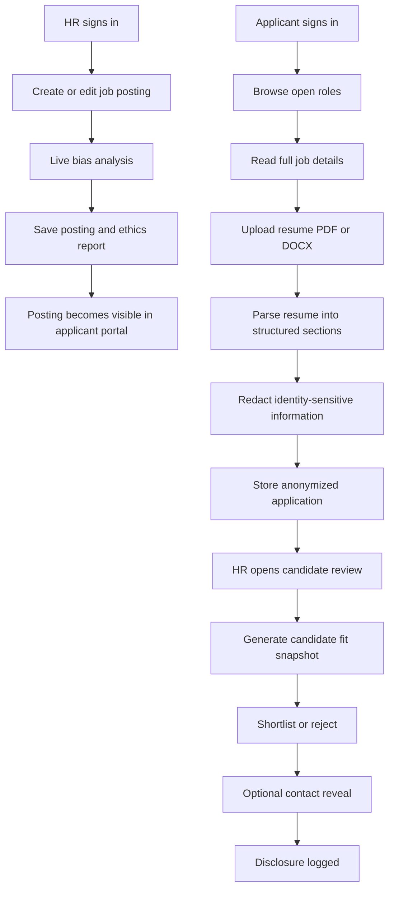
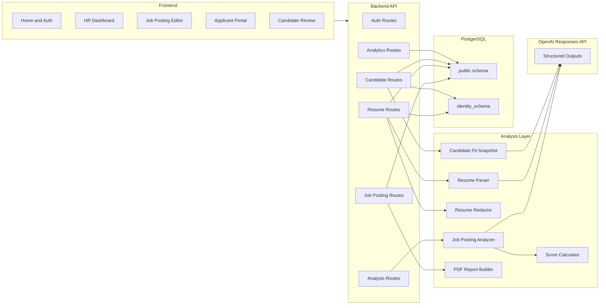

# Ethics Hiring Tracker

Ethics Hiring Tracker is a bias-aware hiring workflow that turns fairness from a policy statement into a product behavior. Instead of treating bias review as a separate compliance task, the platform inserts it directly into job creation, applicant intake, and candidate review.

The system supports two user journeys:

- `HR teams` create job postings, review compliance issues, monitor trends, and evaluate anonymized candidates
- `Applicants` browse roles, read full job details, upload resumes, and track submissions

The core product decision is simple: reduce bias at both ends of the funnel.

- `Before applications`: analyze job postings for exclusionary language and unrealistic requirements
- `After applications`: redact sensitive identity signals before hiring teams review candidates

## Problem

Hiring bias often enters the workflow in two places:

1. `Job posting design`
   Vague, exclusionary, or inflated requirements can discourage qualified applicants before they even apply.
2. `Resume review`
   Names, contact details, school prestige, and other identity-adjacent signals can influence early screening decisions in ways that are unrelated to the actual role.

Ethics Hiring Tracker addresses both by combining policy, UX, and system boundaries in one workflow.

## Product Overview

The platform covers the full hiring loop:

1. HR signs in and creates a job posting.
2. The posting is analyzed for bias, inclusivity gaps, and unrealistic requirements.
3. HR saves the role and receives a compliance score plus issue-level explanations.
4. Applicants browse live roles and read the full job details before applying.
5. Applicants upload a PDF or DOCX resume.
6. The resume is parsed into structured data and redacted before HR review.
7. HR reviews anonymous candidates with a fit snapshot against the posting.
8. HR can shortlist, reject, or explicitly request contact information.
9. Contact disclosure is logged as an accountable action.

## Key Product Decisions

- `Bias review is live`: the job editor updates against the draft instead of waiting for a later audit step.
- `Blind review is the default`: candidate review starts from redacted content, not raw resumes.
- `Identity data is separated`: direct applicant identity is stored outside the main review workflow.
- `Contact reveal is explicit`: HR must actively request contact details, and that request is recorded.
- `LLM use is bounded`: the system uses LLMs for structured analysis and parsing, but falls back to deterministic heuristics if the LLM path is unavailable.

## Workflow



## Architecture



## System Design

### Frontend

The frontend is a React + Vite SPA with role-specific workflows:

- `Home`: product framing and entry point
- `Login / Register`: access for HR and applicants
- `HR Dashboard`: posting queue, trends, issue summaries, report actions
- `Job Posting Editor`: role authoring and live compliance feedback
- `Applicant Portal`: opening list, job details, resume upload, submission tracking
- `Candidate Review`: anonymous queue, fit summary, structured profile, contact reveal

### Backend

The backend is an Express + TypeScript API. Route groups:

- `/api/auth`
- `/api/analyze`
- `/api/job-postings`
- `/api/resumes`
- `/api/analytics`
- candidate review endpoints mounted under `/api/job-postings/:id/candidates`

### Data Model

The PostgreSQL design uses two logical boundaries:

- `public`
  - HR users
  - applicants
  - job postings
  - ethics reports
  - resumes
  - score history
  - contact disclosure log
- `identity_schema`
  - applicant email and phone used only for controlled contact reveal

This separation is a product decision as much as a database decision. It lets the review workflow operate on anonymized content while restricting direct identity access to a narrower path.

## LLM-Assisted Components

When `OPENAI_API_KEY` is configured, the system uses the OpenAI Responses API with structured outputs in three places:

1. `Job posting analysis`
   Detects biased language, exclusionary phrasing, missing inclusive language, and unrealistic requirements.
2. `Resume parsing`
   Extracts structured sections from PDF or DOCX resumes.
3. `Candidate fit snapshot`
   Compares a redacted candidate profile against the selected job posting.

Each of these features has a heuristic fallback path so the app still functions without the LLM.

## Fairness And Privacy Model

The system reduces bias through explicit workflow constraints:

- resumes are parsed before review
- contact information is removed from the review surface
- institution names are withheld in candidate review
- applicant identity is stored separately
- contact reveal requires explicit recruiter intent
- disclosures are logged

This is not positioned as a perfect fairness engine. It is a workflow prototype that makes fairer behavior easier and more accountable.

## Repository Layout

```text
.
|-- backend/
|   |-- src/
|   |   |-- analyzer/
|   |   |-- config/
|   |   |-- db/
|   |   |-- middleware/
|   |   |-- routes/
|   |   |-- types/
|   |   `-- utils/
|-- frontend/
|   |-- src/
|   |   |-- api/
|   |   |-- components/
|   |   |-- constants/
|   |   `-- pages/
|-- docker/
|   `-- postgres/
|-- docker-compose.yml
|-- DEMO_SCRIPT.md
|-- PROJECT_DESCRIPTION.md
`-- README.md
```

## Setup

### Prerequisites

- Node.js 20+
- npm
- Docker Desktop or compatible Docker runtime

### Environment

Create a root `.env` from `.env.example`.

Important variables:

- `DATABASE_URL`
- `CONTACT_DISCLOSURE_DATABASE_URL`
- `JWT_SECRET`
- `PORT`
- `VITE_API_BASE_URL`
- `OPENAI_API_KEY`
- `OPENAI_ANALYSIS_MODEL`
- `OPENAI_RESUME_PARSER_MODEL`

### Start Postgres

```bash
docker compose up -d
```

The database is exposed on host port `5433`.

### Install

```bash
npm install
```

### Run

Backend:

```bash
npm run dev:backend
```

Frontend:

```bash
npm run dev:frontend
```

Default endpoints:

- Frontend: `http://localhost:5173`
- Backend: `http://localhost:4000`

## Verification

```bash
npm run check
npm run build
```

## Current Limitations

- no automated test suite yet
- fairness logic is useful for review support, not a legal compliance replacement
- redaction is pragmatic for a prototype, not a full enterprise privacy system
- historical resumes are not automatically reprocessed when parsing behavior changes

## Submission Companion Files

- [DEMO_SCRIPT.md](C:/Users/96110/Documents/Projects/hackathon/Kiro/DEMO_SCRIPT.md)
- [PROJECT_DESCRIPTION.md](C:/Users/96110/Documents/Projects/hackathon/Kiro/PROJECT_DESCRIPTION.md)

These are included so a reviewer can quickly understand both the live demo flow and the design rationale behind the system.
